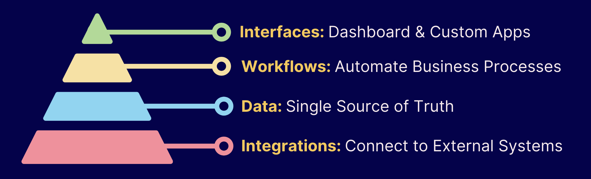

# Augmented OS

> ### **Stop Renting, Start Building**
>
> Seamlessly integrates AI into your everyday workflows


---

## What is Augmented OS?

Augmented OS is an open-source platform that revolutionises how businesses incorporate AI into their operations. It seamlessly blends AI agents, code execution, and human tasks into unified workflows, allowing you to automate processes that previously required expensive custom development. Instead of piecing together multiple SaaS tools that weren't designed to work together, Augmented OS provides an integrated foundation where AI enhances your existing business processes rather than disrupting them.


**Ideal for:**

* Businesses wanting to harness AI without disrupting existing operations
* Organisations seeking to reduce their growing SaaS subscription costs
* Teams that need customised AI-powered workflows but lack technical resources
* Forward-thinking companies preparing for the AI-augmented future of work
* Developers building intelligent business automation solutions

## Key Benefits

* **Future-Proof Your Business**: Integrate AI capabilities with human workflows without disruption
* **Reduce Cost & Complexity**: Replace multiple SaaS subscriptions with one customisable system
* **Eliminate Repetitive Tasks**: Free your team to focus on high-value work while AI handles the rest
* **Build Without Coding**: Create exactly what you need without hiring expensive developers
* **Scale With Flexibility**: Easily adapt workflows as your business grows and changes
* **Gain Total Visibility**: See exactly how your business is performing with a unified dashboard
* **Maintain Data Control**: Keep your sensitive business data secure on dedicated infrastructure

## How It Works

 

Augmented OS provides a complete business operating system built on four layers:


1. **Interfaces**: Dashboards and custom applications
2. **Workflows**: Business process automation
3. **Data**: Unified source of truth
4. **Integrations**: Connections to existing tools

## Getting Started

```bash
# Clone the repository
git clone https://github.com/augmented-os/augmented-os.git
cd augmented-os

# Install dependencies
npm install

# Set up your environment
cp .env.example .env
# Edit your .env file with your database credentials

# Initialize the database
npm run db:init

# Start the development server
npm run dev

# Open http://localhost:3000 in your browser
```

## Use Cases

* **Customer Onboarding**: Automate client intake processes
* **Document Processing**: Extract and route document data
* **Approval Workflows**: Streamline reviews and approvals
* **Sales Pipeline**: Track and automate sales processes
* **Custom CRM**: Build tailored customer relationship management
* **Data Integration**: Connect disparate systems
* **Customer Service**: Handle support with human and AI collaboration

## Documentation

Comprehensive documentation is available in the [docs](./docs) directory:

* [Getting Started Guide](./docs/getting-started.md)
* [Architecture Overview](./docs/architecture/overview.md)
* [Tutorial: Building Your First Workflow](./docs/tutorials/first-workflow.md)
* [API Reference](./docs/api/reference.md)

## Roadmap

* ✓ Working prototype with workflow orchestration & dynamic UI
* → Open source v0 release (Current)
* → Developer tooling and SDK improvements
* → Expanded marketplace of pre-built components
* → Advanced AI agent capabilities

## Contributing

We welcome contributions of all kinds. Please see our [Contributing Guide](CONTRIBUTING.md) to get started.

**Ways to contribute:**

* Report bugs and suggest features
* Improve documentation
* Add new integrations
* Develop workflow templates
* Create reusable task components

## Community

* [Discord Community](https://discord.gg/augmentedos)
* [Twitter](https://twitter.com/augmentedos)
* [Monthly Community Call](https://meet.augmentedos.com/community)


---

## License

Augmented OS is licensed under the [Apache License 2.0](LICENSE).


---

`Ready to build what your business truly needs? Star this repository to follow our progress!`