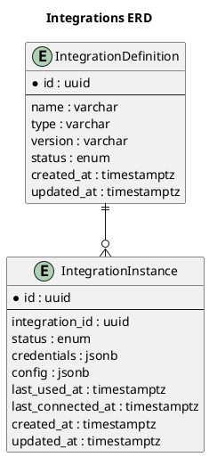

<!-- docs/data_model.md -->

# Integrations component – Data Model

## Overview
The integrations component lets us plug external SaaS systems (e.g. Salesforce, Xero)
into our platform.  
Each connector is described once as an **Integration Definition**.  
Customers then create **Integration Instances** of that definition, supplying their own
credentials and runtime configuration.

## Key concepts

| Concept | Description |
|---------|-------------|
| **Integration Definition** | Immutable metadata that identifies and describes a connector (name, auth type, version, docs URL…). |
| **Integration Instance**   | Tenant‑specific installation of a definition. Carries credentials, config, current status, and telemetry. |
| **Credentials**            | Sensitive secrets (access tokens, API keys) stored in the **`credentials`** `jsonb` column of an instance, encrypted at rest. |
| **Config**                 | Non‑secret runtime knobs (webhook URL, polling interval) stored in the **`config`** `jsonb` column of an instance. |

## Entity–relationship diagram

## Security considerations
* **Encryption at rest** – `credentials` are encrypted with pgcrypto (`pgp_sym_encrypt`) before storage.
* **Row‑level security** – RLS policies ensure a tenant can only read its own instances.
* **Principle of least privilege** – Only the `svc_integration` role has `SELECT` on the credentials column.
* **Auditability** – `created_at`, `updated_at`, `last_used_at`, and `last_connected_at` columns support forensic timelines.

## Further reading
* [`integration_definition.md`](integration_definition.md) – table specification
* [`integration_instances.md`](integration_instances.md) – table specification with embedded JSON column schemas
