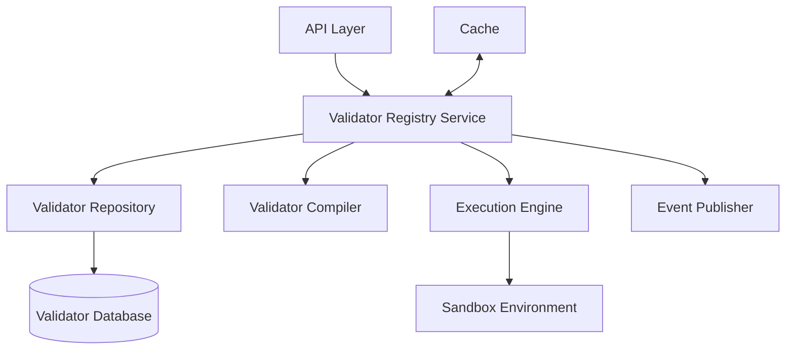
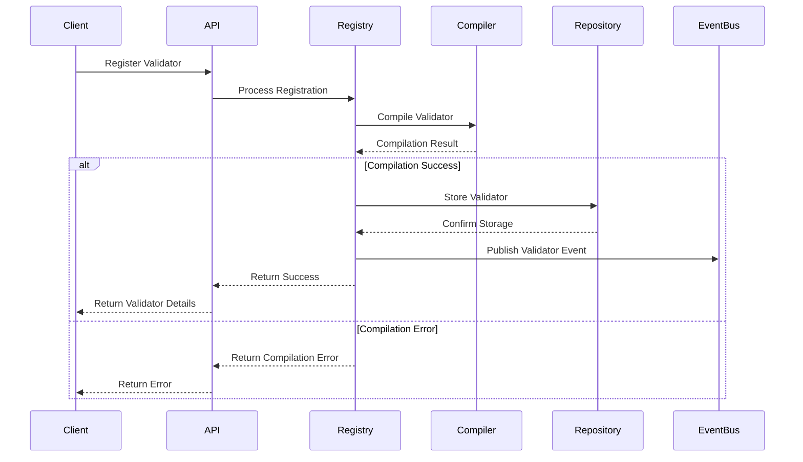

# Custom Validator Registry

The Custom Validator Registry is a component of the Validation Service that manages user-defined validation functions that extend the standard JSON Schema validation capabilities.

## Overview

The Custom Validator Registry provides a mechanism for registering, managing, and executing custom validation logic that goes beyond the standard JSON Schema keywords. These custom validators can implement domain-specific validation rules, complex conditional validations, or integrate with external systems for validation.

## Key Features

* **Custom Keyword Registration**: Define new JSON Schema keywords
* **Multiple Implementation Languages**: Support for JavaScript, Python, and WebAssembly
* **Validator Versioning**: Track changes to validator implementations
* **Secure Execution**: Sandboxed execution environment for validators
* **Performance Optimization**: Compiled and cached validators
* **Reusability**: Share validators across multiple schemas
* **Testing Framework**: Tools for testing custom validators

## Architecture

The Custom Validator Registry is implemented as a module within the Validation Service with these components:



### Components


1. **Validator Registry Service**: Core business logic for validator management
2. **Validator Repository**: Data access layer for validator storage and retrieval
3. **Validator Compiler**: Compiles validator code for efficient execution
4. **Execution Engine**: Executes validators in a controlled environment
5. **Sandbox Environment**: Isolated execution context for security
6. **Validator Database**: Persistent storage for validators
7. **Event Publisher**: Publishes events for validator changes
8. **Cache**: In-memory cache for frequently used validators

## Validator Types

The Custom Validator Registry supports these types of validators:

| Type | Description | Use Case |
|----|----|----|
| **Format** | Validates string formats | Email, phone number, custom identifiers |
| **Keyword** | Implements custom keywords | Business rules, complex conditions |
| **Function** | Standalone validation functions | Cross-field validation, complex calculations |
| **Remote** | Calls external services | Integration with legacy systems, external data validation |
| **Transformation** | Modifies data during validation | Data normalization, type conversion |

## Validator Lifecycle

Custom validators follow this lifecycle:


1. **Development**: Validator is developed and tested locally
2. **Registration**: Validator is registered with the registry
3. **Active Use**: Validator is used in schemas for validation
4. **Update**: Validator implementation is updated as needed
5. **Deprecation**: Validator is marked as deprecated when no longer recommended
6. **Deactivation**: Validator is deactivated but remains in the registry

## Validator Registration Process



## Security Considerations

The Custom Validator Registry implements these security measures:


1. **Code Sandboxing**: Validators run in isolated environments
2. **Resource Limits**: CPU, memory, and execution time limits
3. **No External Network Access**: Validators cannot make network calls
4. **Input Validation**: Validator code is validated before execution
5. **Permission Model**: Role-based access for validator management
6. **Audit Logging**: All validator operations are logged

## Performance Optimization

The Custom Validator Registry optimizes validator performance through:


1. **Compilation**: Validators are compiled to optimized code
2. **Caching**: Frequently used validators are cached
3. **Batching**: Support for validating multiple values at once
4. **Early Termination**: Stop validation on first error when appropriate
5. **Parallel Execution**: Run independent validators in parallel

## Implementation Languages

The Custom Validator Registry supports these implementation languages:

| Language | Execution Method | Use Case |
|----|----|----|
| **JavaScript** | V8 Isolate | General-purpose validators |
| **Python** | PyPy Sandbox | Data science validators |
| **WebAssembly** | WASM Runtime | High-performance validators |
| **Expression Language** | Custom Interpreter | Simple rule expressions |

## API Operations

The Custom Validator Registry exposes these operations through the Validation Service API:

* **Register Validator**: Create a new custom validator
* **Get Validator**: Retrieve a validator by ID
* **List Validators**: List validators with filtering and pagination
* **Update Validator**: Update a validator's implementation
* **Test Validator**: Test a validator with sample data
* **Deprecate Validator**: Mark a validator as deprecated
* **Delete Validator**: Remove a validator from the registry

## Integration with JSON Schema

Custom validators can be used in JSON Schema in these ways:


1. **Custom Keywords**: Define new keywords for use in schemas
2. **Format Validators**: Extend the `format` keyword with custom formats
3. **Function References**: Reference validators by ID in schemas

## Example: Custom Format Validator

```json
// POST /api/v1/validation/validators
{
  "name": "Credit Card Validator",
  "type": "format",
  "description": "Validates credit card numbers using the Luhn algorithm",
  "implementation": {
    "language": "javascript",
    "code": "function validate(value) {\n  // Luhn algorithm implementation\n  if (!/^[0-9]{13,19}$/.test(value)) return false;\n  \n  let sum = 0;\n  let double = false;\n  \n  for (let i = value.length - 1; i >= 0; i--) {\n    let digit = parseInt(value.charAt(i));\n    \n    if (double) {\n      digit *= 2;\n      if (digit > 9) digit -= 9;\n    }\n    \n    sum += digit;\n    double = !double;\n  }\n  \n  return sum % 10 === 0;\n}",
    "config": {
      "formatName": "credit-card",
      "errorMessage": "Invalid credit card number"
    }
  },
  "metadata": {
    "owner": "payment-team",
    "tags": ["payment", "credit-card", "security"]
  }
}
```

## Example: Custom Keyword Validator

```json
// POST /api/v1/validation/validators
{
  "name": "Dependency Validator",
  "type": "keyword",
  "description": "Validates that if one property exists, another property must also exist",
  "implementation": {
    "language": "javascript",
    "code": "function validate(schema, data, context) {\n  if (schema === true) return true;\n  \n  const dependencies = schema;\n  const keys = Object.keys(dependencies);\n  \n  for (const key of keys) {\n    if (data[key] !== undefined) {\n      const requiredProps = dependencies[key];\n      \n      for (const prop of requiredProps) {\n        if (data[prop] === undefined) {\n          context.addError({\n            keyword: 'dependencies',\n            message: `Property ${key} requires property ${prop}`,\n            params: { property: key, dependency: prop }\n          });\n          return false;\n        }\n      }\n    }\n  }\n  \n  return true;\n}",
    "config": {
      "keyword": "propertyDependencies",
      "metaSchema": {
        "type": "object",
        "additionalProperties": {
          "type": "array",
          "items": { "type": "string" },
          "uniqueItems": true
        }
      }
    }
  },
  "metadata": {
    "owner": "schema-team",
    "tags": ["dependencies", "conditional"]
  }
}
```

## Usage in Schema

Once registered, custom validators can be used in schemas:

```json
{
  "type": "object",
  "properties": {
    "creditCard": {
      "type": "string",
      "format": "credit-card"
    },
    "billingAddress": {
      "type": "object",
      "properties": {
        "street": { "type": "string" },
        "city": { "type": "string" },
        "zipCode": { "type": "string" }
      }
    },
    "shippingAddress": {
      "type": "object",
      "properties": {
        "street": { "type": "string" },
        "city": { "type": "string" },
        "zipCode": { "type": "string" }
      }
    }
  },
  "propertyDependencies": {
    "creditCard": ["billingAddress"]
  }
}
```

## Testing Custom Validators

The Custom Validator Registry provides a testing endpoint:

```json
// POST /api/v1/validation/validators/test
{
  "validator": {
    "type": "format",
    "implementation": {
      "language": "javascript",
      "code": "function validate(value) {\n  return /^[A-Z]{2}\\d{6}$/.test(value);\n}"
    }
  },
  "testCases": [
    {
      "input": "AB123456",
      "expectedResult": true
    },
    {
      "input": "AB12345",
      "expectedResult": false
    },
    {
      "input": "12AB3456",
      "expectedResult": false
    }
  ]
}
```

## Related Documentation

* [Data Model](./data_model.md) - Details on the data model used by the Custom Validator Registry
* [API Reference](./interfaces/api.md) - API endpoints for interacting with the Custom Validator Registry
* [Schema Registry](./schema_registry.md) - Documentation on the schema registry component
* [Implementation Guide](./implementation/custom_validator_implementation.md) - Implementation details


