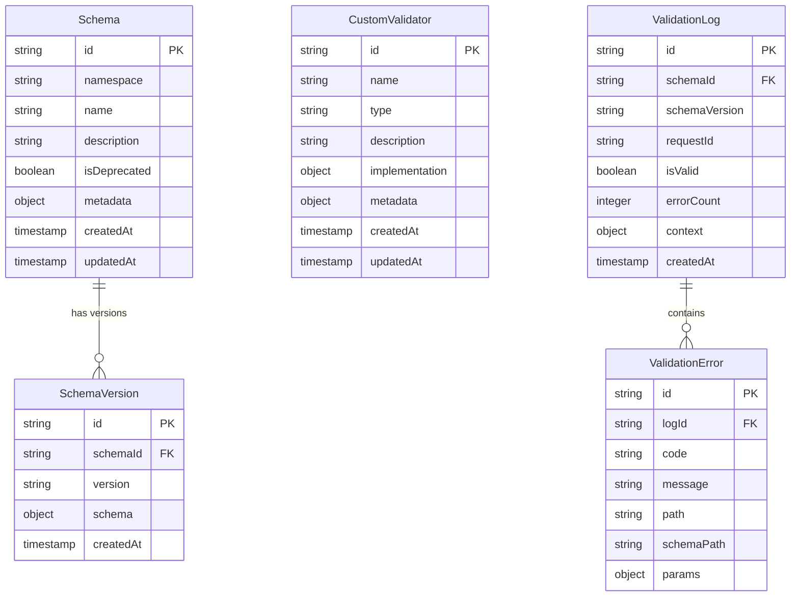

# Validation Service Data Model

This document describes the data model used by the Validation Service, including the core entities, their relationships, and the database schema.

## Overview

The Validation Service maintains several key data entities to support its functionality:

1. **Schemas**: JSON Schema definitions used for validating data
2. **Schema Versions**: Historical versions of schemas
3. **Custom Validators**: User-defined validation functions
4. **Validation Logs**: Records of validation operations and results

## Entity Relationship Diagram



## Database Schema

The Validation Service uses a document-oriented database to store its entities. The following collections are defined:

### Schemas Collection

```json
{
  "_id": "product-schema",
  "namespace": "commerce",
  "name": "Product Schema",
  "description": "Validates product data structure",
  "isDeprecated": false,
  "metadata": {
    "owner": "product-team",
    "compatibility": "backward",
    "tags": ["product", "commerce"]
  },
  "createdAt": "2023-01-15T08:30:00Z",
  "updatedAt": "2023-06-22T14:45:00Z"
}
```

### Schema Versions Collection

```json
{
  "_id": "6a7b8c9d0e1f2g3h4i5j",
  "schemaId": "product-schema",
  "version": "1.2.0",
  "schema": {
    "type": "object",
    "properties": {
      "id": { "type": "string" },
      "name": { "type": "string" },
      "price": { "type": "number", "minimum": 0 },
      "category": { "type": "string" },
      "tags": { "type": "array", "items": { "type": "string" } }
    },
    "required": ["id", "name", "price"]
  },
  "createdAt": "2023-06-22T14:45:00Z"
}
```

### Custom Validators Collection

```json
{
  "_id": "email-validator",
  "name": "Email Validator",
  "type": "format",
  "description": "Validates email addresses with custom rules",
  "implementation": {
    "language": "javascript",
    "code": "function validate(value) { const regex = /^[a-zA-Z0-9._-]+@[a-zA-Z0-9.-]+\\.[a-zA-Z]{2,6}$/; return regex.test(value); }",
    "config": {
      "errorMessage": "Invalid email format"
    }
  },
  "metadata": {
    "owner": "security-team",
    "tags": ["email", "security"]
  },
  "createdAt": "2023-02-10T09:15:00Z",
  "updatedAt": "2023-02-10T09:15:00Z"
}
```

### Validation Logs Collection

```json
{
  "_id": "log123456789",
  "schemaId": "product-schema",
  "schemaVersion": "1.2.0",
  "requestId": "req-abcdef-123456",
  "isValid": false,
  "errorCount": 1,
  "context": {
    "source": "product-import-service",
    "environment": "production",
    "userId": "user123"
  },
  "createdAt": "2023-07-05T16:20:00Z"
}
```

### Validation Errors Collection

```json
{
  "_id": "err987654321",
  "logId": "log123456789",
  "code": "required",
  "message": "Missing required property: price",
  "path": "$",
  "schemaPath": "#/required/2",
  "params": {
    "missingProperty": "price"
  }
}
```

## Data Retention Policies

The Validation Service implements the following data retention policies:

| Entity Type | Retention Period | Archiving Strategy |
|-------------|------------------|-------------------|
| Schemas | Indefinite | N/A - Kept permanently |
| Schema Versions | Indefinite | N/A - Kept permanently |
| Custom Validators | Indefinite | N/A - Kept permanently |
| Validation Logs | 90 days | Archived to cold storage after 30 days |
| Validation Errors | 90 days | Archived with associated logs |

## Data Access Patterns

The most common data access patterns for the Validation Service include:

1. **Schema Lookup**: Retrieving the latest or specific version of a schema by ID
2. **Schema Version History**: Retrieving the version history of a schema
3. **Validator Lookup**: Finding custom validators by type or name
4. **Validation Log Analysis**: Querying logs by schema ID, time range, or validity status
5. **Error Pattern Analysis**: Aggregating common validation errors by schema or time period

## Data Migration Strategy

When schema changes occur, the Validation Service follows these migration principles:

1. **Versioning**: New schema versions are created rather than updating existing ones
2. **Compatibility Checking**: Optional compatibility verification between versions
3. **Gradual Rollout**: New schema versions can be tested with a subset of traffic
4. **Deprecation**: Old schemas are marked as deprecated rather than deleted
5. **Data Transformation**: Transformation functions can be registered to convert data between schema versions

## Related Documentation

- [API Reference](./interfaces/api.md) - Details on the API endpoints for managing schemas and validators
- [Internal Interfaces](./interfaces/internal.md) - Information on internal service interfaces
- [Schema Registry](./schema_registry.md) - Documentation on the schema registry component
- [Custom Validator Registry](./custom_validator_registry.md) - Documentation on the custom validator registry


