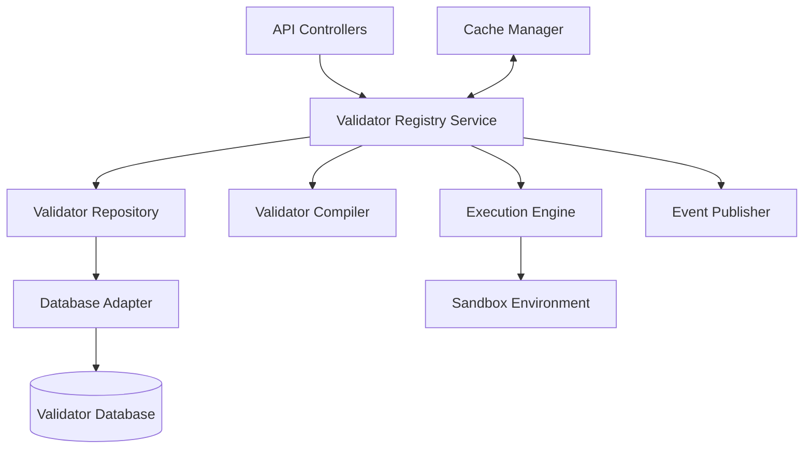

# Custom Validator Implementation Guide

This document provides implementation details for the Custom Validator Registry component of the Validation Service, including architecture, code structure, and key algorithms.

## Architecture Overview

The Custom Validator Registry is implemented using a layered architecture:



## Code Structure

The Custom Validator Registry is organized into these modules:

```
validation_service/
├── validator_registry/
│   ├── api/
│   │   ├── controllers/
│   │   │   ├── validator_controller.ts
│   │   │   └── test_controller.ts
│   │   └── routes/
│   │       └── validator_routes.ts
│   ├── services/
│   │   ├── validator_registry_service.ts
│   │   ├── validator_compiler_service.ts
│   │   └── execution_service.ts
│   ├── repositories/
│   │   └── validator_repository.ts
│   ├── models/
│   │   ├── validator.ts
│   │   └── validator_execution.ts
│   ├── events/
│   │   ├── validator_events.ts
│   │   └── event_publisher.ts
│   ├── cache/
│   │   └── validator_cache.ts
│   ├── sandbox/
│   │   ├── js_runtime.ts
│   │   ├── python_runtime.ts
│   │   └── wasm_runtime.ts
│   └── utils/
│       ├── code_sanitizer.ts
│       └── resource_limiter.ts
```

## Key Interfaces

### Validator Registry Service

```typescript
interface ValidatorRegistryService {
  // Validator Management
  registerValidator(validator: ValidatorRegistration): Promise<Validator>;
  getValidator(id: string): Promise<Validator>;
  listValidators(options: ListOptions): Promise<ValidatorList>;
  updateValidator(id: string, validator: ValidatorUpdate): Promise<Validator>;
  deleteValidator(id: string): Promise<void>;
  
  // Validator Execution
  executeValidator(id: string, value: any, context?: any): Promise<ValidationResult>;
  testValidator(validator: ValidatorTest): Promise<TestResult>;
  
  // Integration with JSON Schema
  getCustomKeywords(): Promise<CustomKeyword[]>;
  getCustomFormats(): Promise<CustomFormat[]>;
}
```

### Validator Repository

```typescript
interface ValidatorRepository {
  // Validator CRUD
  createValidator(validator: ValidatorModel): Promise<ValidatorModel>;
  findValidatorById(id: string): Promise<ValidatorModel | null>;
  findValidators(options: FindOptions): Promise<ValidatorModel[]>;
  countValidators(options: FindOptions): Promise<number>;
  updateValidator(id: string, update: Partial<ValidatorModel>): Promise<void>;
  deleteValidator(id: string): Promise<void>;
  
  // Validator Type Operations
  findValidatorsByType(type: ValidatorType): Promise<ValidatorModel[]>;
  findValidatorsByKeyword(keyword: string): Promise<ValidatorModel | null>;
  findValidatorsByFormat(format: string): Promise<ValidatorModel | null>;
}
```

## Database Schema

The Custom Validator Registry uses these database collections/tables:

### Validators Collection

```typescript
interface ValidatorModel {
  id: string;              // Primary key
  name: string;            // Human-readable name
  type: ValidatorType;     // Type of validator
  description: string;     // Optional description
  implementation: {        // Implementation details
    language: string;      // Programming language
    code: string;          // Source code
    config: object;        // Configuration options
  };
  metadata: {              // Additional metadata
    owner: string;         // Owner/team
    tags: string[];        // Searchable tags
  };
  compiledCode?: string;   // Cached compiled code
  createdAt: Date;         // Creation timestamp
  updatedAt: Date;         // Last update timestamp
}

enum ValidatorType {
  FORMAT = 'format',
  KEYWORD = 'keyword',
  FUNCTION = 'function',
  REMOTE = 'remote',
  TRANSFORMATION = 'transformation'
}
```

### Validator Execution Logs

```typescript
interface ValidatorExecutionLog {
  id: string;              // Primary key
  validatorId: string;     // Foreign key to validator
  input: string;           // Serialized input value
  result: boolean;         // Validation result
  errors: object[];        // Validation errors if any
  duration: number;        // Execution duration in ms
  resources: {             // Resource usage
    cpu: number;           // CPU time in ms
    memory: number;        // Memory usage in bytes
  };
  timestamp: Date;         // Execution timestamp
}
```

## Validator Compilation

The Custom Validator Registry compiles validators for efficient execution:

```typescript
async function compileValidator(validator: ValidatorModel): Promise<CompiledValidator> {
  const { language, code, config } = validator.implementation;
  
  // Sanitize code to prevent security issues
  const sanitizedCode = sanitizeCode(code, language);
  
  switch (language) {
    case 'javascript':
      return compileJavaScript(sanitizedCode, config);
    
    case 'python':
      return compilePython(sanitizedCode, config);
    
    case 'webassembly':
      return compileWebAssembly(sanitizedCode, config);
    
    case 'expression':
      return compileExpression(sanitizedCode, config);
    
    default:
      throw new Error(`Unsupported language: ${language}`);
  }
}

async function compileJavaScript(code: string, config: object): Promise<CompiledValidator> {
  // Create a sandboxed function from the code
  const functionBody = `
    return function validate(value, context) {
      ${code}
    };
  `;
  
  // Compile in sandbox
  const isolate = new JavaScriptIsolate();
  const compiledFunction = await isolate.compile(functionBody);
  
  return {
    type: 'javascript',
    compiled: compiledFunction,
    config,
    meta: {
      compiledSize: estimateSize(compiledFunction),
      compilationTime: performance.now() - startTime
    }
  };
}
```

## Validator Execution

The Custom Validator Registry executes validators in a controlled environment:

```typescript
async function executeValidator(
  compiledValidator: CompiledValidator, 
  value: any, 
  context?: any
): Promise<ValidationResult> {
  const startTime = performance.now();
  
  try {
    // Set up resource limits
    const resourceLimiter = new ResourceLimiter({
      cpu: MAX_CPU_TIME,
      memory: MAX_MEMORY,
      timeout: EXECUTION_TIMEOUT
    });
    
    // Execute in sandboxed environment
    const runtime = getRuntimeForType(compiledValidator.type);
    const sandbox = new Sandbox(runtime, resourceLimiter);
    
    const result = await sandbox.execute(
      compiledValidator.compiled,
      value,
      context || {}
    );
    
    // Record resource usage
    const resourceUsage = resourceLimiter.getUsage();
    
    return {
      valid: Boolean(result.value),
      errors: result.errors || [],
      meta: {
        duration: performance.now() - startTime,
        resources: resourceUsage
      }
    };
  } catch (error) {
    // Handle execution errors
    return {
      valid: false,
      errors: [{
        code: 'VALIDATOR_EXECUTION_ERROR',
        message: error.message
      }],
      meta: {
        duration: performance.now() - startTime,
        error: serializeError(error)
      }
    };
  }
}
```

## Security Implementation

The Custom Validator Registry implements several security measures to prevent malicious code execution:

```typescript
class SecurityManager {
  // Code sanitization to prevent dangerous patterns
  sanitizeCode(code: string, language: string): string {
    const sanitizer = this.getSanitizerForLanguage(language);
    return sanitizer.sanitize(code);
  }
  
  // Static analysis to detect potential security issues
  analyzeCode(code: string, language: string): SecurityAnalysisResult {
    const analyzer = this.getAnalyzerForLanguage(language);
    return analyzer.analyze(code);
  }
  
  // Runtime security enforcement
  createSecurityPolicy(validatorType: ValidatorType): SecurityPolicy {
    // Default security policies by validator type
    const policies: Record<ValidatorType, SecurityPolicy> = {
      [ValidatorType.FORMAT]: {
        allowFileAccess: false,
        allowNetworkAccess: false,
        allowProcessSpawn: false,
        timeLimit: 100, // ms
        memoryLimit: 10 * 1024 * 1024, // 10MB
      },
      [ValidatorType.KEYWORD]: {
        allowFileAccess: false,
        allowNetworkAccess: false,
        allowProcessSpawn: false,
        timeLimit: 200, // ms
        memoryLimit: 20 * 1024 * 1024, // 20MB
      },
      // Policies for other validator types
    };
    
    return policies[validatorType] || this.getDefaultSecurityPolicy();
  }
}
```

### Sandbox Implementation

```typescript
class Sandbox {
  private readonly vm: any; // Runtime-specific VM
  private readonly securityPolicy: SecurityPolicy;
  
  constructor(runtime: Runtime, securityPolicy: SecurityPolicy) {
    this.vm = runtime.createVM();
    this.securityPolicy = securityPolicy;
    this.applySecurityPolicy();
  }
  
  private applySecurityPolicy(): void {
    // Apply file system restrictions
    if (!this.securityPolicy.allowFileAccess) {
      this.vm.disableFileSystem();
    }
    
    // Apply network restrictions
    if (!this.securityPolicy.allowNetworkAccess) {
      this.vm.disableNetwork();
    }
    
    // Apply process spawn restrictions
    if (!this.securityPolicy.allowProcessSpawn) {
      this.vm.disableProcessSpawn();
    }
    
    // Apply resource limits
    this.vm.setResourceLimits({
      timeLimit: this.securityPolicy.timeLimit,
      memoryLimit: this.securityPolicy.memoryLimit
    });
  }
  
  async execute(code: any, input: any, context: any): Promise<ExecutionResult> {
    return this.vm.execute(code, [input, context]);
  }
}
```

## Caching Strategy

The Custom Validator Registry implements a caching strategy for compiled validators:

```typescript
class ValidatorCache {
  private readonly memoryCache: Map<string, CacheEntry>;
  private readonly persistentCache: PersistentCache;
  
  async getCompiledValidator(id: string): Promise<CompiledValidator | null> {
    const cacheKey = `validator:${id}:compiled`;
    
    // Try memory cache first
    const memoryEntry = this.memoryCache.get(cacheKey);
    if (memoryEntry && !this.isExpired(memoryEntry)) {
      return memoryEntry.validator;
    }
    
    // Try persistent cache
    const persistentEntry = await this.persistentCache.get(cacheKey);
    if (persistentEntry) {
      // Update memory cache
      this.memoryCache.set(cacheKey, {
        validator: persistentEntry,
        timestamp: Date.now()
      });
      return persistentEntry;
    }
    
    return null;
  }
  
  async setCompiledValidator(id: string, validator: CompiledValidator): Promise<void> {
    const cacheKey = `validator:${id}:compiled`;
    
    // Update memory cache
    this.memoryCache.set(cacheKey, {
      validator,
      timestamp: Date.now()
    });
    
    // Update persistent cache
    await this.persistentCache.set(cacheKey, validator, this.TTL);
  }
  
  async invalidateValidator(id: string): Promise<void> {
    const cacheKey = `validator:${id}:compiled`;
    
    // Remove from memory cache
    this.memoryCache.delete(cacheKey);
    
    // Remove from persistent cache
    await this.persistentCache.delete(cacheKey);
  }
  
  private isExpired(entry: CacheEntry): boolean {
    return Date.now() - entry.timestamp > this.memoryTTL;
  }
}
```

## Error Handling

The Custom Validator Registry implements these error handling strategies:

```typescript
class ValidatorRegistryError extends Error {
  constructor(
    message: string,
    public readonly code: ValidatorErrorCode,
    public readonly details?: object
  ) {
    super(message);
    this.name = 'ValidatorRegistryError';
  }
}

enum ValidatorErrorCode {
  VALIDATOR_NOT_FOUND = 'VALIDATOR_NOT_FOUND',
  VALIDATOR_ALREADY_EXISTS = 'VALIDATOR_ALREADY_EXISTS',
  INVALID_VALIDATOR_CODE = 'INVALID_VALIDATOR_CODE',
  COMPILATION_ERROR = 'COMPILATION_ERROR',
  EXECUTION_ERROR = 'EXECUTION_ERROR',
  SECURITY_VIOLATION = 'SECURITY_VIOLATION',
  RESOURCE_LIMIT_EXCEEDED = 'RESOURCE_LIMIT_EXCEEDED',
  DATABASE_ERROR = 'DATABASE_ERROR'
}

function handleValidatorRegistryError(error: unknown): HttpResponse {
  if (error instanceof ValidatorRegistryError) {
    switch (error.code) {
      case ValidatorErrorCode.VALIDATOR_NOT_FOUND:
        return createResponse(404, {
          error: {
            code: error.code,
            message: error.message,
            details: error.details
          }
        });
      
      case ValidatorErrorCode.VALIDATOR_ALREADY_EXISTS:
        return createResponse(409, {
          error: {
            code: error.code,
            message: error.message,
            details: error.details
          }
        });
      
      case ValidatorErrorCode.INVALID_VALIDATOR_CODE:
      case ValidatorErrorCode.COMPILATION_ERROR:
        return createResponse(422, {
          error: {
            code: error.code,
            message: error.message,
            details: error.details
          }
        });
      
      case ValidatorErrorCode.SECURITY_VIOLATION:
        return createResponse(403, {
          error: {
            code: error.code,
            message: error.message,
            details: error.details
          }
        });
      
      case ValidatorErrorCode.RESOURCE_LIMIT_EXCEEDED:
        return createResponse(429, {
          error: {
            code: error.code,
            message: error.message,
            details: error.details
          }
        });
      
      default:
        return createResponse(500, {
          error: {
            code: error.code,
            message: error.message
          }
        });
    }
  }
  
  // Handle unexpected errors
  console.error('Unexpected error:', error);
  return createResponse(500, {
    error: {
      code: 'INTERNAL_SERVER_ERROR',
      message: 'An unexpected error occurred'
    }
  });
}
```

## Testing Framework

The Custom Validator Registry provides a testing framework for validators:

```typescript
interface ValidatorTest {
  validator: {
    type: ValidatorType;
    implementation: {
      language: string;
      code: string;
      config?: object;
    };
  };
  testCases: {
    input: any;
    expectedResult: boolean;
    context?: object;
  }[];
}

async function testValidator(test: ValidatorTest): Promise<TestResult> {
  // Compile the validator
  const compiledValidator = await compileValidator({
    id: 'test-validator',
    name: 'Test Validator',
    type: test.validator.type,
    description: 'Temporary validator for testing',
    implementation: test.validator.implementation,
    metadata: {},
    createdAt: new Date(),
    updatedAt: new Date()
  });
  
  // Run test cases
  const results = await Promise.all(
    test.testCases.map(async (testCase) => {
      const result = await executeValidator(
        compiledValidator,
        testCase.input,
        testCase.context
      );
      
      const passed = result.valid === testCase.expectedResult;
      
      return {
        input: testCase.input,
        expectedResult: testCase.expectedResult,
        actualResult: result.valid,
        passed,
        errors: result.errors,
        duration: result.meta.duration
      };
    })
  );
  
  // Aggregate results
  const passedCount = results.filter(r => r.passed).length;
  const totalCount = results.length;
  
  return {
    success: passedCount === totalCount,
    summary: {
      total: totalCount,
      passed: passedCount,
      failed: totalCount - passedCount,
      duration: results.reduce((sum, r) => sum + r.duration, 0)
    },
    results
  };
}
```

## Integration with JSON Schema

The Custom Validator Registry integrates with JSON Schema validation:

```typescript
class JsonSchemaIntegration {
  private readonly validatorRegistry: ValidatorRegistryService;
  private readonly ajv: any; // Ajv instance
  
  constructor(validatorRegistry: ValidatorRegistryService, ajv: any) {
    this.validatorRegistry = validatorRegistry;
    this.ajv = ajv;
    this.registerCustomKeywords();
    this.registerCustomFormats();
  }
  
  private async registerCustomKeywords(): Promise<void> {
    // Get all custom keyword validators
    const keywords = await this.validatorRegistry.getCustomKeywords();
    
    // Register each keyword with Ajv
    for (const keyword of keywords) {
      this.ajv.addKeyword({
        keyword: keyword.config.keyword,
        type: keyword.config.type || undefined,
        metaSchema: keyword.config.metaSchema || undefined,
        async validate(schema: any, data: any): Promise<boolean> {
          // Execute the custom validator
          const result = await this.validatorRegistry.executeValidator(
            keyword.id,
            data,
            { schema, parentData: this.parentData, parentDataProperty: this.parentDataProperty }
          );
          
          // Add any errors to Ajv's error collection
          if (!result.valid && result.errors) {
            for (const error of result.errors) {
              this.addError(error);
            }
          }
          
          return result.valid;
        }
      });
    }
  }
  
  private async registerCustomFormats(): Promise<void> {
    // Get all custom format validators
    const formats = await this.validatorRegistry.getCustomFormats();
    
    // Register each format with Ajv
    for (const format of formats) {
      this.ajv.addFormat(format.config.formatName, {
        type: format.config.type || 'string',
        async validate(data: any): Promise<boolean> {
          // Execute the custom validator
          const result = await this.validatorRegistry.executeValidator(
            format.id,
            data,
            {}
          );
          
          return result.valid;
        }
      });
    }
  }
}
```

## Performance Considerations

The Custom Validator Registry addresses these performance considerations:

1. **Compilation Caching**: Validators are compiled once and cached for reuse
2. **Optimized Runtimes**: Language-specific optimizations for execution
3. **Resource Pooling**: VM instances are pooled and reused
4. **Batch Validation**: Support for validating multiple values in one call
5. **Parallel Execution**: Independent validators can run in parallel
6. **Cold Start Mitigation**: Pre-warming of sandbox environments
7. **Validator Analysis**: Static analysis to optimize performance

## Deployment Considerations

The Custom Validator Registry can be deployed in these configurations:

1. **Embedded**: As part of the Validation Service
2. **Standalone**: As a separate microservice for heavy validation workloads
3. **Scalable**: Horizontal scaling for high validator execution demand
4. **Resilient**: Failover and retry strategies for execution errors

## Related Documentation

- [Custom Validator Registry](../custom_validator_registry.md) - High-level overview of the Custom Validator Registry
- [Data Model](../data_model.md) - Details on the data model used by the Custom Validator Registry
- [API Reference](../interfaces/api.md) - API endpoints for interacting with the Custom Validator Registry
- [Schema Registry Implementation](./schema_registry_implementation.md) - Implementation details for the related Schema Registry


