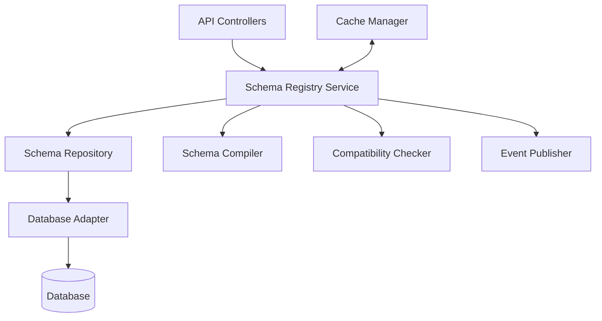

# Schema Registry Implementation Guide

This document provides implementation details for the Schema Registry component of the Validation Service, including architecture, code structure, and key algorithms.

## Architecture Overview

The Schema Registry is implemented using a layered architecture:



## Code Structure

The Schema Registry is organized into these modules:

```
validation_service/
├── schema_registry/
│   ├── api/
│   │   ├── controllers/
│   │   │   ├── schema_controller.ts
│   │   │   └── compatibility_controller.ts
│   │   └── routes/
│   │       └── schema_routes.ts
│   ├── services/
│   │   ├── schema_registry_service.ts
│   │   ├── schema_compiler_service.ts
│   │   └── compatibility_service.ts
│   ├── repositories/
│   │   └── schema_repository.ts
│   ├── models/
│   │   ├── schema.ts
│   │   └── schema_version.ts
│   ├── events/
│   │   ├── schema_events.ts
│   │   └── event_publisher.ts
│   ├── cache/
│   │   └── schema_cache.ts
│   └── utils/
│       ├── schema_validator.ts
│       └── version_utils.ts
```

## Key Interfaces

### Schema Registry Service

```typescript
interface SchemaRegistryService {
  // Schema Management
  registerSchema(schema: SchemaRegistration): Promise<Schema>;
  getSchema(id: string, version?: string): Promise<Schema>;
  listSchemas(options: ListOptions): Promise<SchemaList>;
  updateSchema(id: string, schema: SchemaUpdate, options: UpdateOptions): Promise<Schema>;
  deprecateSchema(id: string): Promise<void>;
  
  // Compatibility
  checkCompatibility(id: string, schema: object, type: CompatibilityType): Promise<CompatibilityResult>;
  
  // Schema Compilation
  compileSchema(schema: object): Promise<CompiledSchema>;
}
```

### Schema Repository

```typescript
interface SchemaRepository {
  // Schema CRUD
  createSchema(schema: SchemaModel): Promise<SchemaModel>;
  createSchemaVersion(version: SchemaVersionModel): Promise<SchemaVersionModel>;
  findSchemaById(id: string): Promise<SchemaModel | null>;
  findSchemaVersions(schemaId: string): Promise<SchemaVersionModel[]>;
  findSchemaVersion(schemaId: string, version: string): Promise<SchemaVersionModel | null>;
  findLatestSchemaVersion(schemaId: string): Promise<SchemaVersionModel | null>;
  findSchemas(options: FindOptions): Promise<SchemaModel[]>;
  countSchemas(options: FindOptions): Promise<number>;
  updateSchema(id: string, update: Partial<SchemaModel>): Promise<void>;
}
```

## Database Schema

The Schema Registry uses these database collections/tables:

### Schemas Collection

```typescript
interface SchemaModel {
  id: string;              // Primary key
  namespace: string;       // Logical grouping
  name: string;            // Human-readable name
  description: string;     // Optional description
  isDeprecated: boolean;   // Deprecation flag
  metadata: {              // Additional metadata
    owner: string;         // Owner/team
    compatibility: string; // Compatibility type
    tags: string[];        // Searchable tags
  };
  createdAt: Date;         // Creation timestamp
  updatedAt: Date;         // Last update timestamp
}
```

### Schema Versions Collection

```typescript
interface SchemaVersionModel {
  id: string;              // Primary key
  schemaId: string;        // Foreign key to schema
  version: string;         // Semver version
  schema: object;          // The actual JSON schema
  createdAt: Date;         // Creation timestamp
}
```

## Key Algorithms

### Schema Versioning

The Schema Registry uses semantic versioning with these rules:

```typescript
function determineVersionIncrement(
  currentSchema: object, 
  newSchema: object, 
  compatibilityResult: CompatibilityResult
): VersionIncrement {
  if (!compatibilityResult.compatible) {
    return 'MAJOR'; // Breaking change
  }
  
  // Check for additions (non-breaking changes)
  if (hasNewProperties(currentSchema, newSchema)) {
    return 'MINOR';
  }
  
  // No structural changes, just metadata or descriptions
  return 'PATCH';
}

function generateNewVersion(currentVersion: string, increment: VersionIncrement): string {
  const [major, minor, patch] = currentVersion.split('.').map(Number);
  
  switch (increment) {
    case 'MAJOR':
      return `${major + 1}.0.0`;
    case 'MINOR':
      return `${major}.${minor + 1}.0`;
    case 'PATCH':
      return `${major}.${minor}.${patch + 1}`;
    default:
      throw new Error('Invalid version increment');
  }
}
```

### Schema Compatibility Checking

The Schema Registry implements these compatibility checks:

```typescript
function checkBackwardCompatibility(oldSchema: object, newSchema: object): CompatibilityResult {
  const incompatibilities = [];
  
  // Check for removed required properties
  const oldRequired = getRequiredProperties(oldSchema);
  const newRequired = getRequiredProperties(newSchema);
  
  for (const prop of oldRequired) {
    if (!newRequired.includes(prop)) {
      incompatibilities.push({
        type: 'REMOVED_REQUIRED_PROPERTY',
        path: `#/required/${prop}`,
        description: `Required property '${prop}' was removed`,
        severity: 'BREAKING'
      });
    }
  }
  
  // Check for narrowed property types
  const oldProperties = getProperties(oldSchema);
  const newProperties = getProperties(newSchema);
  
  for (const [propName, oldPropSchema] of Object.entries(oldProperties)) {
    const newPropSchema = newProperties[propName];
    
    if (newPropSchema) {
      if (isTypeNarrowed(oldPropSchema, newPropSchema)) {
        incompatibilities.push({
          type: 'NARROWED_TYPE',
          path: `#/properties/${propName}`,
          description: `Property '${propName}' type was narrowed`,
          severity: 'BREAKING'
        });
      }
    }
  }
  
  // More checks for other compatibility issues...
  
  return {
    compatible: incompatibilities.length === 0,
    level: 'BACKWARD',
    changes: detectChanges(oldSchema, newSchema),
    incompatibilities
  };
}
```

### Schema Compilation

The Schema Registry compiles schemas for efficient validation:

```typescript
async function compileSchema(schema: object): Promise<CompiledSchema> {
  // Resolve all schema references
  const resolvedSchema = await resolveReferences(schema);
  
  // Optimize schema for validation
  const optimizedSchema = optimizeSchema(resolvedSchema);
  
  // Compile schema to executable form
  const compiledSchema = ajv.compile(optimizedSchema);
  
  return {
    schema: resolvedSchema,
    optimizedSchema,
    compiledSchema,
    meta: {
      referencesResolved: countResolvedReferences(resolvedSchema),
      compilationTime: performance.now() - startTime
    }
  };
}
```

## Caching Strategy

The Schema Registry implements a multi-level caching strategy:

```typescript
class SchemaCache {
  private readonly memoryCache: Map<string, CacheEntry>;
  private readonly distributedCache: DistributedCache;
  
  async getSchema(id: string, version?: string): Promise<Schema | null> {
    const cacheKey = this.generateCacheKey(id, version);
    
    // Try memory cache first
    const memoryEntry = this.memoryCache.get(cacheKey);
    if (memoryEntry && !this.isExpired(memoryEntry)) {
      return memoryEntry.schema;
    }
    
    // Try distributed cache
    const distributedEntry = await this.distributedCache.get(cacheKey);
    if (distributedEntry) {
      // Update memory cache
      this.memoryCache.set(cacheKey, {
        schema: distributedEntry,
        timestamp: Date.now()
      });
      return distributedEntry;
    }
    
    return null;
  }
  
  async setSchema(schema: Schema): Promise<void> {
    const cacheKey = this.generateCacheKey(schema.id, schema.version);
    
    // Update memory cache
    this.memoryCache.set(cacheKey, {
      schema,
      timestamp: Date.now()
    });
    
    // Update distributed cache
    await this.distributedCache.set(cacheKey, schema, this.TTL);
  }
  
  async invalidateSchema(id: string): Promise<void> {
    // Invalidate all versions of the schema
    const keysToInvalidate = Array.from(this.memoryCache.keys())
      .filter(key => key.startsWith(`schema:${id}:`));
    
    // Remove from memory cache
    for (const key of keysToInvalidate) {
      this.memoryCache.delete(key);
    }
    
    // Remove from distributed cache
    await this.distributedCache.deleteMany(keysToInvalidate);
  }
  
  private generateCacheKey(id: string, version?: string): string {
    return `schema:${id}:${version || 'latest'}`;
  }
  
  private isExpired(entry: CacheEntry): boolean {
    return Date.now() - entry.timestamp > this.memoryTTL;
  }
}
```

## Event Publishing

The Schema Registry publishes events for schema changes:

```typescript
class SchemaEventPublisher {
  private readonly eventBus: EventBus;
  
  async publishSchemaCreated(schema: Schema): Promise<void> {
    await this.eventBus.publish('validation.schema.created', {
      schemaId: schema.id,
      version: schema.version,
      namespace: schema.namespace,
      name: schema.name,
      timestamp: new Date().toISOString()
    });
  }
  
  async publishSchemaUpdated(schema: Schema): Promise<void> {
    await this.eventBus.publish('validation.schema.updated', {
      schemaId: schema.id,
      version: schema.version,
      namespace: schema.namespace,
      name: schema.name,
      timestamp: new Date().toISOString()
    });
  }
  
  async publishSchemaDeprecated(schemaId: string): Promise<void> {
    await this.eventBus.publish('validation.schema.deprecated', {
      schemaId,
      timestamp: new Date().toISOString()
    });
  }
}
```

## Error Handling

The Schema Registry implements these error handling strategies:

```typescript
class SchemaRegistryError extends Error {
  constructor(
    message: string,
    public readonly code: SchemaErrorCode,
    public readonly details?: object
  ) {
    super(message);
    this.name = 'SchemaRegistryError';
  }
}

enum SchemaErrorCode {
  SCHEMA_NOT_FOUND = 'SCHEMA_NOT_FOUND',
  SCHEMA_VERSION_NOT_FOUND = 'SCHEMA_VERSION_NOT_FOUND',
  SCHEMA_ALREADY_EXISTS = 'SCHEMA_ALREADY_EXISTS',
  INVALID_SCHEMA = 'INVALID_SCHEMA',
  INCOMPATIBLE_SCHEMA = 'INCOMPATIBLE_SCHEMA',
  DATABASE_ERROR = 'DATABASE_ERROR'
}

function handleSchemaRegistryError(error: unknown): HttpResponse {
  if (error instanceof SchemaRegistryError) {
    switch (error.code) {
      case SchemaErrorCode.SCHEMA_NOT_FOUND:
      case SchemaErrorCode.SCHEMA_VERSION_NOT_FOUND:
        return createResponse(404, {
          error: {
            code: error.code,
            message: error.message,
            details: error.details
          }
        });
      
      case SchemaErrorCode.SCHEMA_ALREADY_EXISTS:
        return createResponse(409, {
          error: {
            code: error.code,
            message: error.message,
            details: error.details
          }
        });
      
      case SchemaErrorCode.INVALID_SCHEMA:
      case SchemaErrorCode.INCOMPATIBLE_SCHEMA:
        return createResponse(422, {
          error: {
            code: error.code,
            message: error.message,
            details: error.details
          }
        });
      
      default:
        return createResponse(500, {
          error: {
            code: error.code,
            message: error.message
          }
        });
    }
  }
  
  // Handle unexpected errors
  console.error('Unexpected error:', error);
  return createResponse(500, {
    error: {
      code: 'INTERNAL_SERVER_ERROR',
      message: 'An unexpected error occurred'
    }
  });
}
```

## Performance Considerations

The Schema Registry implementation addresses these performance considerations:


1. **Schema Compilation**: Schemas are compiled once and cached for reuse
2. **Lazy Loading**: Schema references are resolved only when needed
3. **Batch Operations**: Support for bulk schema operations
4. **Pagination**: All list operations support pagination
5. **Indexing**: Database indexes on frequently queried fields
6. **Caching**: Multi-level caching strategy for schema lookups
7. **Asynchronous Events**: Non-blocking event publishing

## Deployment Considerations

The Schema Registry can be deployed in these configurations:


1. **Embedded**: As part of the Validation Service
2. **Standalone**: As a separate microservice
3. **Distributed**: With replicas for high availability
4. **Clustered**: With a shared distributed cache

## Related Documentation

* [Schema Registry](../schema_registry.md) - High-level overview of the Schema Registry
* [Data Model](../data_model.md) - Details on the data model used by the Schema Registry
* [API Reference](../interfaces/api.md) - API endpoints for interacting with the Schema Registry


