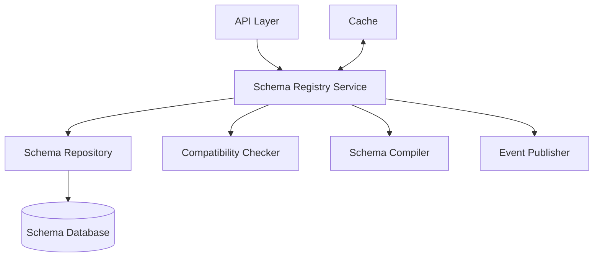
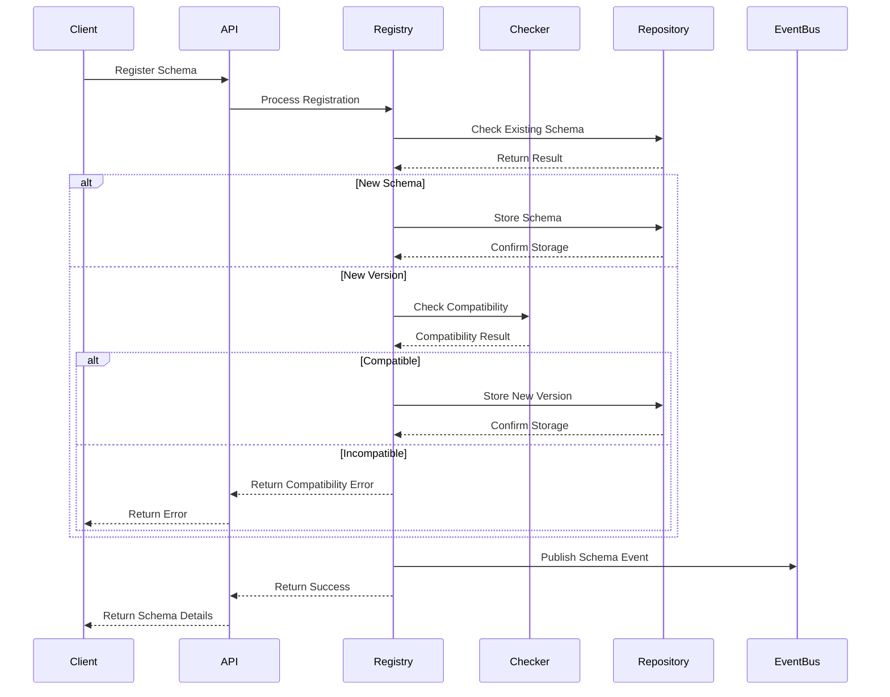

# Schema Registry

The Schema Registry is a core component of the Validation Service that manages the storage, retrieval, and versioning of JSON schemas used for data validation throughout the system.

## Overview

The Schema Registry provides a centralized repository for all validation schemas, enabling consistent data validation across different services and applications. It supports schema versioning, compatibility checking, and schema evolution over time.

## Key Features

- **Schema Storage**: Persistent storage of JSON schemas with metadata
- **Versioning**: Support for semantic versioning of schemas
- **Namespaces**: Logical grouping of related schemas
- **Compatibility Checking**: Verification of compatibility between schema versions
- **Schema Evolution**: Controlled evolution of schemas over time
- **Search & Discovery**: Finding schemas by ID, namespace, or metadata
- **Access Control**: Role-based permissions for schema management

## Architecture

The Schema Registry is implemented as a module within the Validation Service with these components:



### Components

1. **Schema Registry Service**: Core business logic for schema management
2. **Schema Repository**: Data access layer for schema storage and retrieval
3. **Compatibility Checker**: Verifies compatibility between schema versions
4. **Schema Compiler**: Compiles and optimizes schemas for validation
5. **Schema Database**: Persistent storage for schemas and metadata
6. **Event Publisher**: Publishes events for schema changes
7. **Cache**: In-memory cache for frequently accessed schemas

## Schema Lifecycle

Schemas in the registry follow this lifecycle:

1. **Registration**: Schema is registered with a unique ID and initial version
2. **Active Use**: Schema is used for validation by various services
3. **Evolution**: New versions are created as requirements change
4. **Deprecation**: Schema is marked as deprecated when no longer recommended
5. **Archival**: Schema is archived but still accessible for historical data

## Schema Versioning

The Schema Registry uses semantic versioning (MAJOR.MINOR.PATCH) for schema versions:

- **MAJOR**: Incompatible changes that may break existing data
- **MINOR**: Backward-compatible additions to the schema
- **PATCH**: Backward-compatible fixes (e.g., description changes)

## Compatibility Types

The Schema Registry supports these compatibility types:

| Type | Description | Use Case |
|------|-------------|----------|
| **BACKWARD** | New schema can read data written with old schema | Default for most schemas |
| **FORWARD** | Old schema can read data written with new schema | When readers evolve more slowly than writers |
| **FULL** | Both backward and forward compatible | Ideal but sometimes restrictive |
| **NONE** | No compatibility guarantees | For complete schema rewrites |

## Schema Registration Process



## Schema Lookup Performance

The Schema Registry optimizes schema lookup performance through:

1. **In-memory Caching**: Frequently used schemas are cached
2. **Compiled Schemas**: Pre-compiled for faster validation
3. **Database Indexing**: Optimized indexes for common queries
4. **Batch Operations**: Support for bulk schema retrieval

## Schema Evolution Strategies

The Schema Registry supports these schema evolution strategies:

1. **Additive Changes**: Adding optional fields (backward compatible)
2. **Field Relaxation**: Relaxing constraints on existing fields
3. **Type Widening**: Expanding allowed types for a field
4. **Versioned Endpoints**: Different API versions using different schema versions
5. **Transformation Functions**: Custom functions to transform data between versions

## API Operations

The Schema Registry exposes these operations through the Validation Service API:

- **Register Schema**: Create a new schema or version
- **Get Schema**: Retrieve a schema by ID and optional version
- **List Schemas**: List schemas with filtering and pagination
- **Check Compatibility**: Check compatibility between schema versions
- **Deprecate Schema**: Mark a schema as deprecated
- **Search Schemas**: Search schemas by metadata or content

## Schema Metadata

Each schema in the registry includes metadata:

- **Owner**: Team or individual responsible for the schema
- **Description**: Purpose and usage of the schema
- **Tags**: Searchable tags for categorization
- **Creation Date**: When the schema was first registered
- **Last Modified**: When the schema was last updated
- **Compatibility Setting**: Required compatibility type
- **Usage Statistics**: How frequently the schema is used

## Integration with Other Components

The Schema Registry integrates with:

1. **Validation Engine**: Provides schemas for data validation
2. **Custom Validator Registry**: References custom validators used in schemas
3. **Monitoring System**: Reports schema usage metrics
4. **Event Bus**: Publishes events for schema changes
5. **API Gateway**: Provides schema information for API documentation

## Example: Schema Registration

```json
// POST /api/v1/validation/schemas
{
  "id": "user-profile",
  "namespace": "users",
  "name": "User Profile Schema",
  "description": "Validates user profile data structure",
  "schema": {
    "type": "object",
    "properties": {
      "id": { "type": "string", "format": "uuid" },
      "username": { "type": "string", "minLength": 3, "maxLength": 50 },
      "email": { "type": "string", "format": "email" },
      "age": { "type": "integer", "minimum": 13 },
      "preferences": {
        "type": "object",
        "properties": {
          "theme": { "type": "string", "enum": ["light", "dark", "system"] },
          "notifications": { "type": "boolean" }
        }
      }
    },
    "required": ["id", "username", "email"]
  },
  "metadata": {
    "owner": "user-service-team",
    "compatibility": "backward",
    "tags": ["user", "profile", "core"]
  }
}
```

## Example: Schema Compatibility Check

```json
// POST /api/v1/validation/schemas/user-profile/compatibility-check
{
  "schema": {
    "type": "object",
    "properties": {
      "id": { "type": "string", "format": "uuid" },
      "username": { "type": "string", "minLength": 3, "maxLength": 50 },
      "email": { "type": "string", "format": "email" },
      "age": { "type": "integer", "minimum": 13 },
      "preferences": {
        "type": "object",
        "properties": {
          "theme": { "type": "string", "enum": ["light", "dark", "system"] },
          "notifications": { "type": "boolean" },
          "language": { "type": "string", "default": "en" }
        }
      }
    },
    "required": ["id", "username", "email"]
  },
  "compatibilityType": "backward"
}
```

## Related Documentation

- [Data Model](./data_model.md) - Details on the data model used by the Schema Registry
- [API Reference](./interfaces/api.md) - API endpoints for interacting with the Schema Registry
- [Custom Validator Registry](./custom_validator_registry.md) - Documentation on custom validators
- [Implementation Guide](./implementation/schema_registry_implementation.md) - Implementation details 